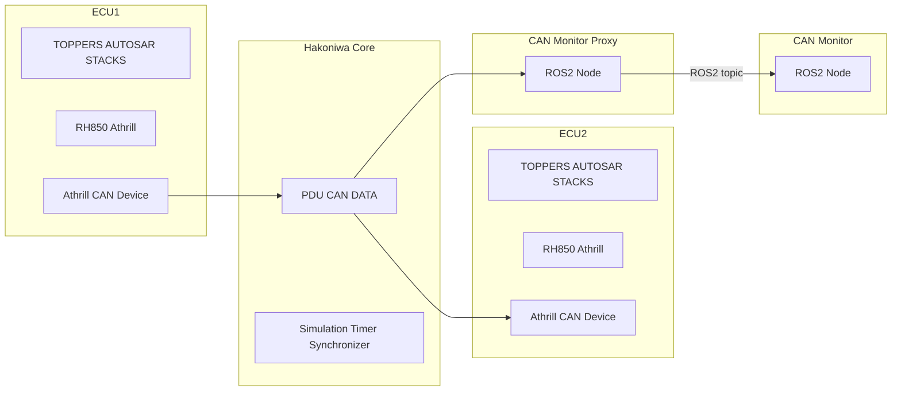

# hakoniwa-ecu-multiplay

複数の車載ECUを箱庭（仮想シミュレーション）環境で動作させるための環境です。
以下では、2つのECU間でCAN通信を行う

## 目次

- [hakoniwa-ecu-multiplay](#hakoniwa-ecu-multiplay)
  - [目次](#目次)
  - [ECU間通信の例（C++版箱庭コア機能）](#ecu間通信の例c版箱庭コア機能)
    - [仮想ランタイム環境とCANデータの流れ](#仮想ランタイム環境とcanデータの流れ)
  - [使用する環境変数](#使用する環境変数)
  - [ATK2 Sample1のビルド方法](#atk2-sample1のビルド方法)
    - [athrillを使ったATK2の実行方法](#athrillを使ったatk2の実行方法)
  - [A-RTEGEN の HelloWorldWithCOM を使った例（ビルド）](#a-rtegen-の-helloworldwithcom-を使った例ビルド)
    - [ECU1（送信側）のビルド](#ecu1送信側のビルド)
    - [ECU2（受信側）のビルド](#ecu2受信側のビルド)
  - [A-RTEGEN の HelloWorldWithCOM を使った例（実行）](#a-rtegen-の-helloworldwithcom-を使った例実行)
    - [ターミナル1(hako-master)](#ターミナル1hako-master)
    - [ターミナル2(ECU1)](#ターミナル2ecu1)
    - [ターミナル3(ECU2)](#ターミナル3ecu2)
    - [ターミナル4(hako-cmd)](#ターミナル4hako-cmd)
  - [A-COMSTACKを使ったCAN通信の例 : ビルド方法](#a-comstackを使ったcan通信の例--ビルド方法)
  - [A-COMSTACKを使ったCAN通信の例 : 実行方法](#a-comstackを使ったcan通信の例--実行方法)
    - [ターミナル２ (ROS TOPIC)](#ターミナル２-ros-topic)
    - [ターミナル３ (CAN Application using TOPPERS Automotive Stacks)](#ターミナル３-can-application-using-toppers-automotive-stacks)

## ECU間通信の例（C++版箱庭コア機能）
詳細手順はTOPPERS活用アイデア・アプリケーション開発コンテストの[ドキュメント](https://www.toppers.jp/docs/contest/2022/A01_mori.pdf)を参照（）

### 仮想ランタイム環境とCANデータの流れ



## 使用する環境変数

```
HAKO_WS_ECU1="a-rtegen/sample/sc1/HelloAutosarWithCom/hsbrh850f1k_gcc/ecu1"
HAKO_WS_ECU2="a-rtegen/sample/sc1/HelloAutosarWithCom/hsbrh850f1k_gcc/ecu2"
HAKO_WS_CAN="a-comstack/can/target/hsbrh850f1k_gcc/sample"
```

## ATK2 Sample1のビルド方法

```
mkdir -p /workspaces/hakoniwa-ecu-multiplay/atk2-sc1/OBJ ;cd /workspaces/hakoniwa-ecu-multiplay/atk2-sc1/OBJ
../configure -T hsbrh850f1k_gcc
cp /home/hako/athrill-target-rh850f1x/params/rh850f1k/atk2-sc1/* .
make

```

### athrillを使ったATK2の実行方法
```
athrill2 -c1 -i -d device_config.txt -m memory.txt atk2-sc1

core id num=1
ROM : START=0x0 SIZE=1024
RAM : START=0xfede8000 SIZE=512
ELF SET CACHE RIGION:addr=0x0 size=62 [KB]
Elf loading was succeeded:0x0 - 0xf89b : 62.155 KB
Elf loading was succeeded:0xf89c - 0x1205c : 0.220 KB
ELF SYMBOL SECTION LOADED:index=16
ELF SYMBOL SECTION LOADED:sym_num=597
ELF STRING TABLE SECTION LOADED:index=17
DEBUG_FUNC_FT_LOG_SIZE=1024
[DBG>
HIT break:0x0
[NEXT> pc=0x0 prc_support.S 256
c      <======  INPUT `c` 
[CPU>
TOPPERS/ATK2-SC1 Release 1.4.2 for HSBRH850F1K (Jul 17 2022, 09:27:45)

Input Command:
```


## A-RTEGEN の HelloWorldWithCOM を使った例（ビルド）

### ECU1（送信側）のビルド
```
cd $HAKO_WS_ECU1
bash configure.sh
make
cp /home/hako/athrill-target-rh850f1x/params/rh850f1k/atk2-sc1/* .
sed -i -e "s|/root|/home/hako|g" memory_with_hako.txt
```

### ECU2（受信側）のビルド
```
cd $HAKO_WS_ECU2
bash configure.sh
make
cp /home/hako/athrill-target-rh850f1x/params/rh850f1k/atk2-sc1/* .
sed -i -e "s|/root|/home/hako|g" memory_with_hako.txt
```

## A-RTEGEN の HelloWorldWithCOM を使った例（実行）

### ターミナル1(hako-master)
次のコマンドを実行し待機状態とする
```
$ hako-master 100 200
START
```
### ターミナル2(ECU1)
```
cd $HAKO_WS_ECU1
$ hako-proxy ./proxy_config_rte_ecu1.json
add_option:/home/hako/athrill-target-rh850f1x/athrill/bin/linux/athrill2
add_option:-c1
add_option:-t
add_option:-1
add_option:-d
add_option:device_config_with_rte_hako_ecu1.txt
add_option:-m
add_option:memory_with_hako.txt
add_option:atk2-sc1
INFO: PROXY start
```
### ターミナル3(ECU2)
```
cd $HAKO_WS_ECU2
$ hako-proxy ./proxy_config_rte_ecu2.json
add_option:/home/hako/athrill-target-rh850f1x/athrill/bin/linux/athrill2
add_option:-c1
add_option:-t
add_option:-1
add_option:-d
add_option:device_config_with_rte_hako_ecu2.txt
add_option:-m
add_option:memory_with_hako.txt
add_option:atk2-sc1
INFO: PROXY start
```

### ターミナル4(hako-cmd)
```
$ hako-cmd start
```


## A-COMSTACKを使ったCAN通信の例 : ビルド方法

```
cd $HAKO_WS_CAN/
cp /home/hako/athrill-target-rh850f1x/params/rh850f1k/atk2-sc1/* .
make can
make
```

## A-COMSTACKを使ったCAN通信の例 : 実行方法

```
$ source /opt/ros/foxy/setup.bash
$ ros2 daemon start
The daemon has been started

$ hako-master 100 100
```

### ターミナル２ (ROS TOPIC)
- Step1 running ros2 topic
```
source /opt/ros/foxy/setup.bash
ros2 topic echo /channel0/CAN_IDE0_RTR0_DLC8_0x001 std_msgs/msg/String
```

- Step2 CAN logging after run can application
```
data: "\x01\x02\x03\x04\x05\x06\a\b"
---
data: "\x02\x03\x04\x05\x06\a\b\t"
---
data: "\x03\x04\x05\x06\a\b\t\n"
---
data: "\x04\x05\x06\a\b\t\n\v"
---
data: "\x05\x06\a\b\t\n\v\f"
---
data: "\x06\a\b\t\n\v\f\r"
---
data: "\a\b\t\n\v\f\r\x0E"
---
data: "\b\t\n\v\f\r\x0E\x0F"
---
data: "\t\n\v\f\r\x0E\x0F\x10"
```

### ターミナル３ (CAN Application using TOPPERS Automotive Stacks)

- Step1 Run athrill
```
cd $HAKO_WS_CAN
athrill2 -c1 -i -d device_config_with_can.txt -m memory.txt atk2-sc1.exe
core id num=1
ROM : START=0x0 SIZE=1024
RAM : START=0xfede8000 SIZE=512
ELF SET CACHE RIGION:addr=0x0 size=57 [KB]
Elf loading was succeeded:0x0 - 0xe680 : 57.640 KB
Elf loading was succeeded:0xe680 - 0x128c4 : 0.160 KB
ELF SYMBOL SECTION LOADED:index=16
ELF SYMBOL SECTION LOADED:sym_num=602
ELF STRING TABLE SECTION LOADED:index=17
DEBUG_FUNC_MROS_TOPIC_PUB_0 = channel0/CAN_IDE0_RTR0_DLC8_0x001
DEBUG_FUNC_MROS_TOPIC_SUB_0 = channel0/CAN_IDE0_RTR0_DLC8_0x123
DEBUG_FUNC_MROS_TOPIC_SUB_1 = channel0/CAN_IDE0_RTR0_DLC8_0x122
DEBUG_FUNC_MROS_TOPIC_SUB_2 = channel0/CAN_IDE0_RTR0_DLC8_0x003
DEBUG_FUNC_MROS_TOPIC_SUB_3 = channel0/CAN_IDE0_RTR0_DLC8_0x004
DEBUG_FUNC_MROS_MASTER_IPADDR = 127.0.0.1
mros_master_ipaddr=127.0.0.1
mros_slave_port_no=21411
mros_uri_slave=http://127.0.0.1:21411
mros_publisher_port_no=21511
DEBUG_FUNC_FT_LOG_SIZE=1024
**********mROS main task start**********

[DBG>
HIT break:0x0
[NEXT> pc=0x0 prc_support.S 256
```
- Step2 Continue Athrill simulation and run CAN application
```
c
[CPU>
TOPPERS/ATK2-SC1 Release 1.4.2 for HSBRH850F1K (Jul 23 2022, 01:41:36)

== finished StartupHook ==
== Can_Init ==
== CanIf_ControllerModeIndication(0, 2) ==
[FCN0] Can_Write(3) CAN-ID:0x1
DATA[0]:0x0
DATA[1]:0x1
DATA[2]:0x2
DATA[3]:0x3
DATA[4]:0x4
DATA[5]:0x5
DATA[6]:0x6
DATA[7]:0x7

== finished SendTask ==
== CanIf_TxConfirmation(3) ==
```
